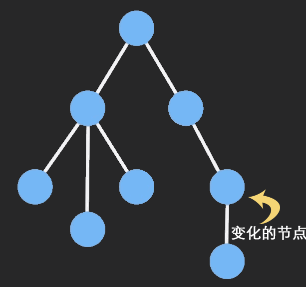

## Immutable

-Immutable Data 就是一旦创建，就不能再被更改的数据。对 Immutable 对象的任何修改或添加删除操作都会返回一个新的 Immutable 对象。Immutable 实现的原理是 Persistent Data Structure（持久化数据结构）。

### API

### 优点

1.  Immutable 降低了 Mutable 带来的复杂度
2.  节省内存
3.  Undo/Redo，Copy/Paste，甚至时间旅行这些功能做起来小菜一碟
4.  并发安全
5.  拥抱函数式编程

### 缺点

1.  需要学习新的 API
2.  增加了资源文件大小
3.  容易与原生对象混淆
