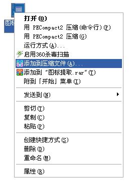
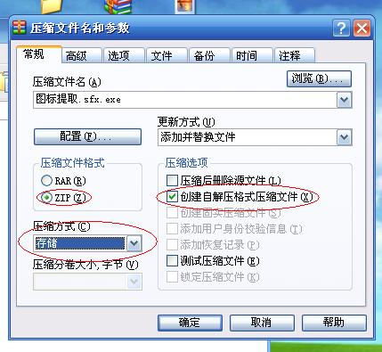
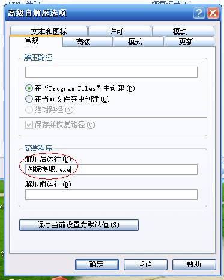
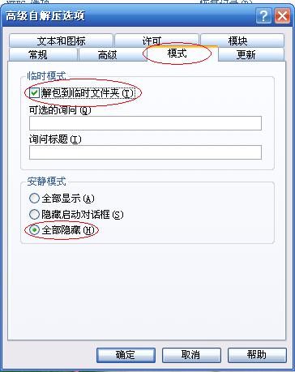

## 前端跨界之 pc应用开发

> zip -r ../nwjs.app/Contents/Resources/app.nw *
> 合并压缩代码
> 替换图标
.icns(mac)

### Windows
 
#### 步骤
>* 压缩文件 更名为 app.nw
>* copy /b nw.exe+app.nw app.exe (直接把你的文件放到 依赖项里，打包)
>* 下载Enigma Virtual Box 将文件打包
>* 利用zip 更换 icon

#### 更换图标步骤
>* 首先右击它，选择“添加到压缩文件”。

>* 在弹出来的一个“压缩文件名和参数”框中设置压缩文件格式为“ZIP”,压缩方式为“存储”，压缩选项为“创建自解压格式压缩文件”。

>* 随后选择“高级”选项卡。选择了“高级”选项卡以后直接点击“自解压选项”。

>* 这时候又弹出一个“高级自解压选项”框，在安装程序中设置解压后运行“图标提取.exe”

>* 然后选择“模式”选项卡，在临时模式中勾选“解包到临时文件夹”，安静模式中选择“全部隐藏”

>* 随后再选择“更新”选项卡，再覆盖方式中选择“覆盖所有文件”。

>* 最后选择“文本和图标”选项卡，在自定义自解压文件徽标和图标中选择“从文件加载自解压文件图标”，点击“浏览”，找到自己想要加载的图标文件后并打开。

>* 然后就点击确定（两次）就可以生成一个新的exe程序了。看看！图标已经改变了，再运行测试一下，是不是能够正常运行？答案是肯定的。
