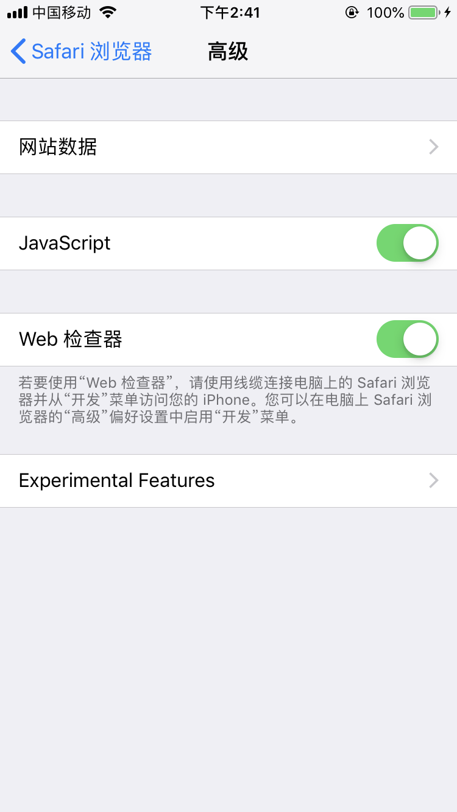
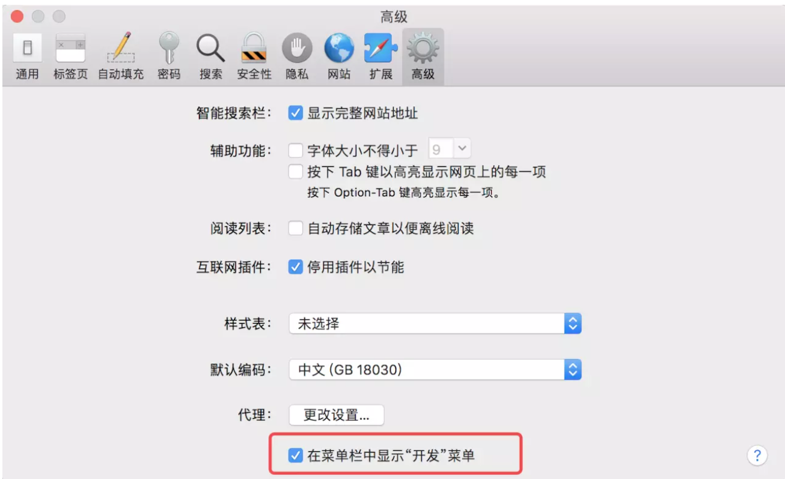
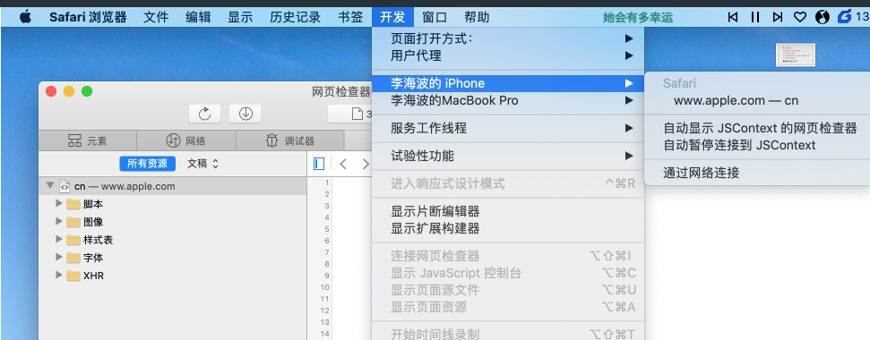
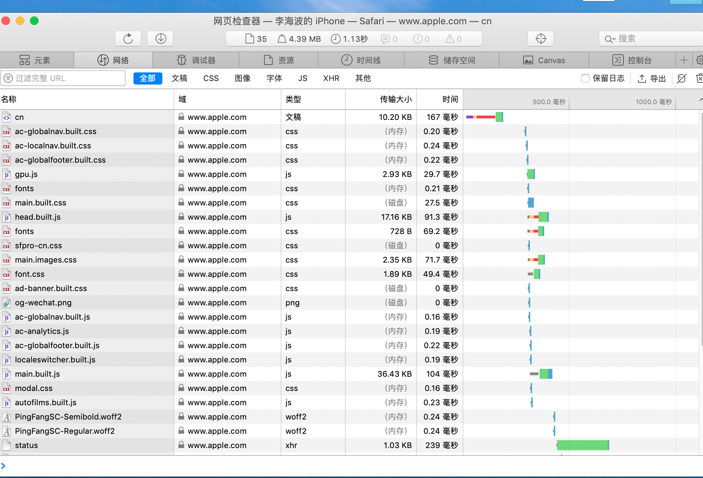

# Mac + IOS + Safari

如果你手上有一台 Mac 电脑和一部苹果手机，那么恭喜你，你离解决 bug 只差一个 usb 了

> 第一步：打开苹果手机 设置 > Safari 浏览器 > 高级 > Web 检查器

> 第二步： 打开 Mac 上的 Safari 浏览器 > 偏好设置 > 高级 > 在菜单栏中显示“开发”菜单

> 第三步： 用数据线连接你的 Mac 电脑和苹果手机，并选择信任设备。然后在手机的 Safari 浏览器 中打开你需要调试的页面，并在电脑上点击下图红框的位置。

> 第四步：点击之后就会出现如下图所示的，几乎和电脑一样的调试界面

