> - 前期准备

- liunx 基本命令
- git 基本命令
- nginx
- jenkins
  > - 工具
- github 账号和项目
- git
- 一台 centos 服务器

###### 坐稳啦！ 要开车啦！

#### 首先登录你远程服务器地址

输入远程服务器地址 ssh 用户名@远程服务器 ip 地址
首次登录有提示信息 输入 yes 就好了
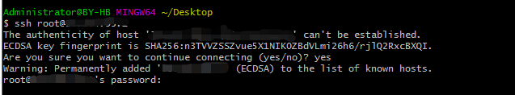

登录成功！
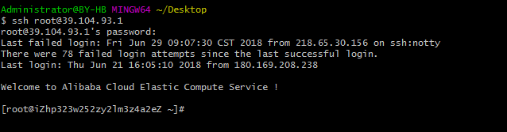

输入 nginx -v
command not found
说明服务器没有安装 nginx
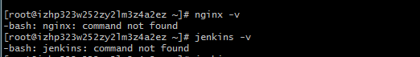

输入 yum install nginx
如果没有 输入 yum install epel-release

然后在输入 yum install nginx
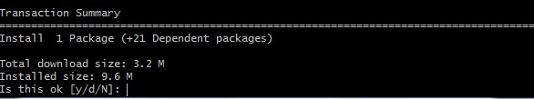
输入 y 回车
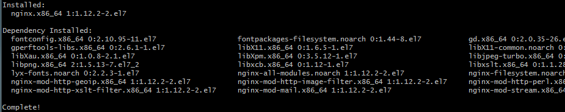
然后告诉我们已经安装完毕
输入 nginx -v
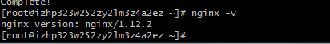
nginx 已经安装完毕
输入 nginx -t 查看配置文件地址
输入 cd /etc/nginx
输入 ls
修改 nginx.conf 配置文件
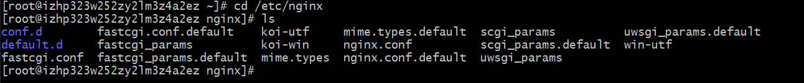
输入 vim nginx.conf
如果没有可以安装 yum install vim 然后执行上一条命令
vim 编辑器用法 输入 i
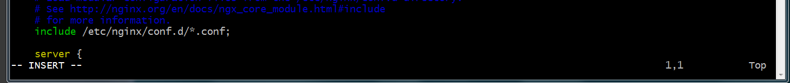
编辑器底部出现 insert 后 你可以编辑配置文件了；
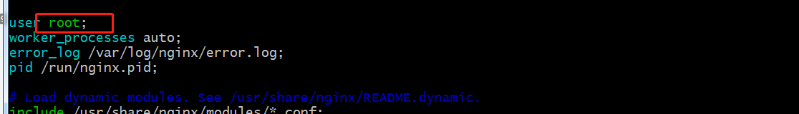
修改 配置 user 改成 root (服务器用户名 我的是 root)
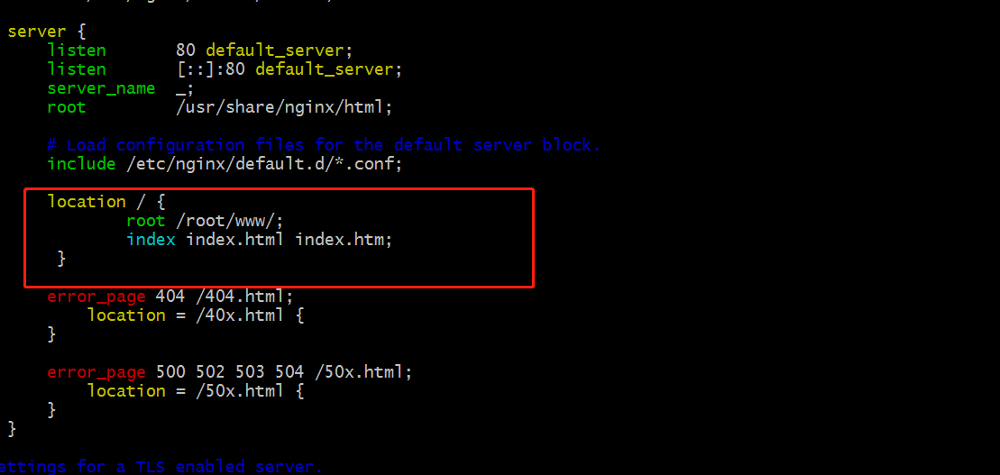
这是默认静态资源文件存放的地址
输入 esc 退出编辑模式
输入 ：+wq 保存退出
nginx -t 查看配置文件是否报错
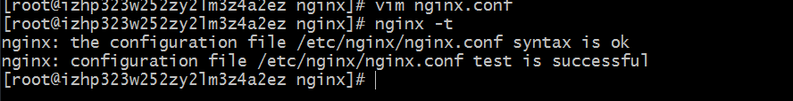
显示成功
cd /root
ls  
如果没有看到 www 目录创建
mkdir www
cd www
vim index.html 创建 index.html 文件
输入一下内容（hello world）
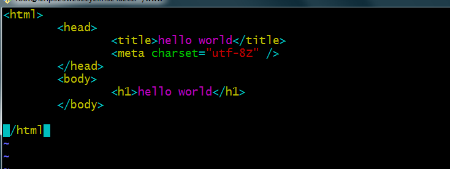
保存退出
启动 nginx
输入 nginx
然后在本地浏览器输入你的 ip 地址加/index.html 就能看到大大的 hello world 至此 服务器配置 server 结束
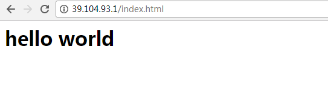

下面配置 jenkins
首先要先下载 java 和 git
yum install java
yum install git

首先要先添加 Jenkins 源:
wget -O /etc/yum.repos.d/jenkins.repo http://pkg.jenkins-ci.org/redhat/jenkins.repo
rpm --import https://jenkins-ci.org/redhat/jenkins-ci.org.key

完成之后直接使用 yum 命令安装 Jenkins
yum install jenkins

Jenkins 修改权限
vim /etc/sysconfig/jenkins

找到$JENKINS_USER 改为 “root”:
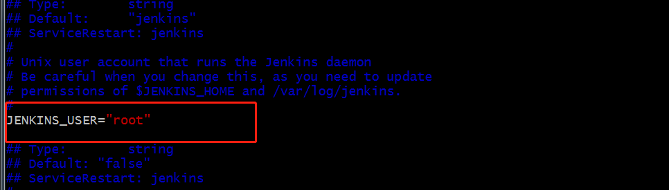

然后更改执行以下命令 Jenkins home，webroot 和日志的所有权：

chown -R root:root /var/lib/jenins
chown -R root:root /var/cache/jenkins
chown -R root:root /var/log/jenkins

启动 jenkins
service jenkins restart

jenkins 启动成功
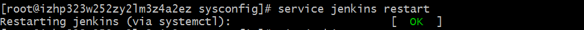

然后在本地浏览器输入你的 ip 地址加 默认端口 8080 就可以看到 jenkins 解锁页面啦

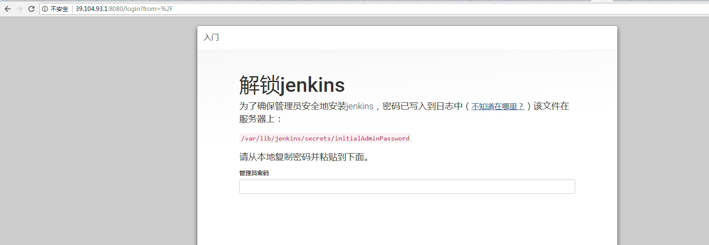
要输入管理员密码
那么刚刚安装的时候忘记保存了也没关系

页面上有提示 那我们就 去指定的目录找吧
vim /var/lib/jenkins/secrets/initialAdminPassword
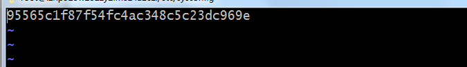
就得到了密码串 复制到输入框执行一下步吧
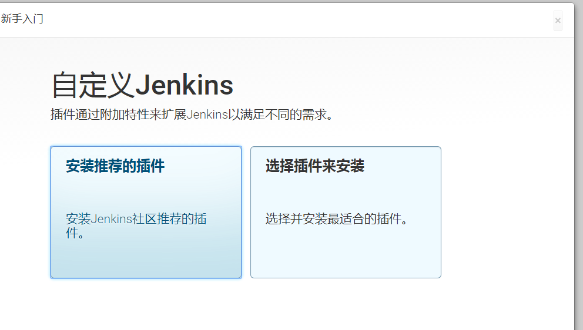
选择安装推荐的插件即可
等待安装
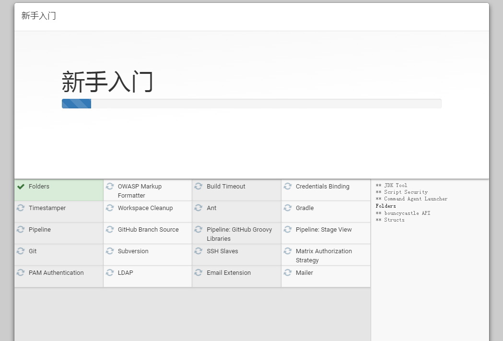

不用多说输入就好了 执行 保存并完成
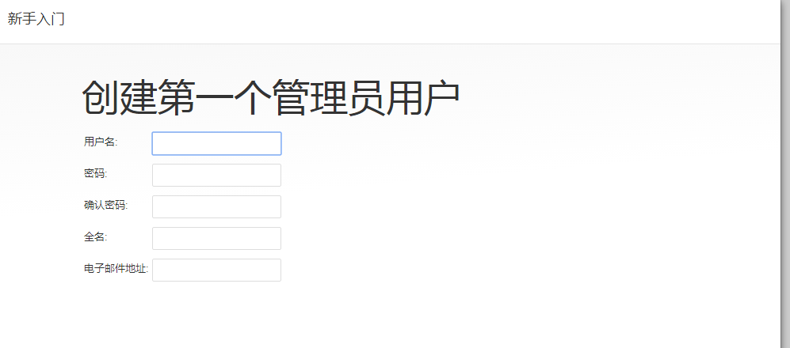
下一步默认 就好了 开始使用 jenkins
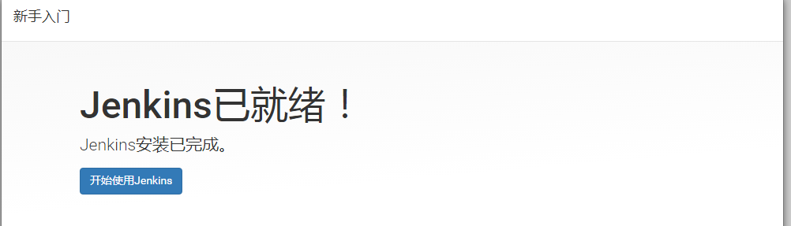

开始配置第一个 jinkens 任务
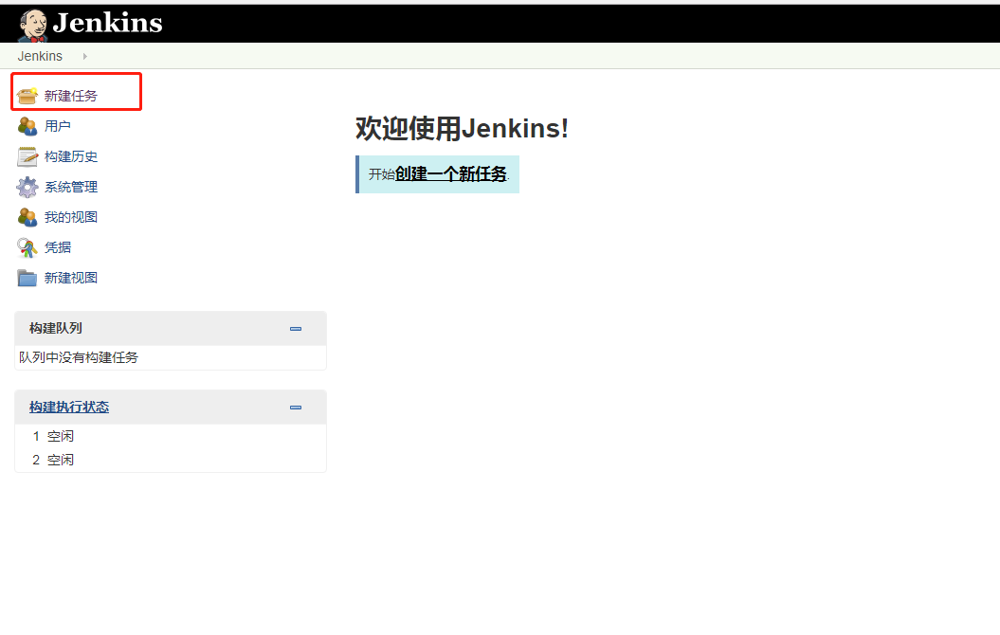

创建一个自由风格的 输入名称 点击确定就好了
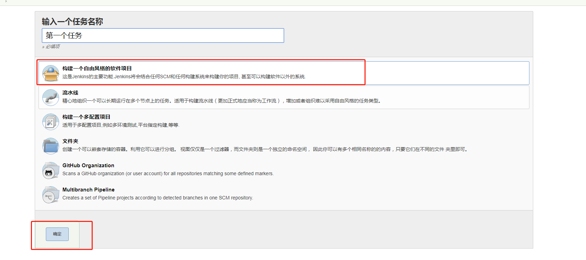

输入描述
输入你的 git URL 地址
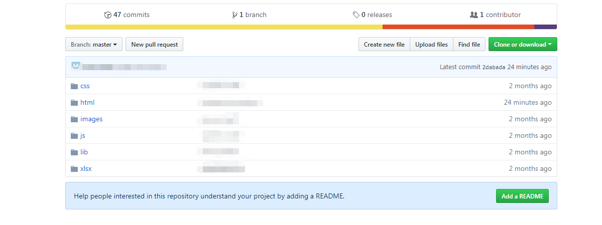

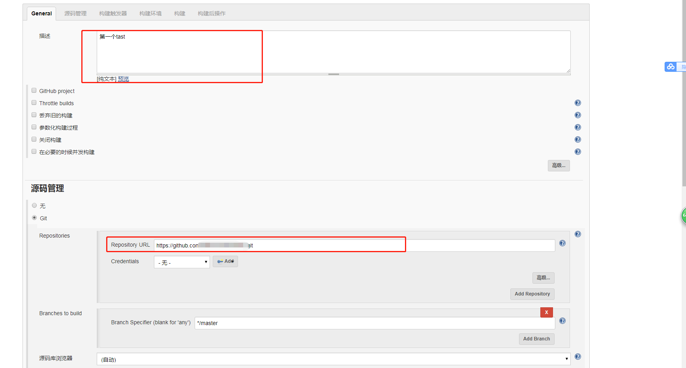

在构建中选择 执行 shell 输入以下命令
rm -rf test.tar.gz
tar czvf test.tar.gz \*
mv -f test.tar.gz /root/www
cd /root/www
tar -xzvf test.tar.gz
rm -rf test.tar.gz
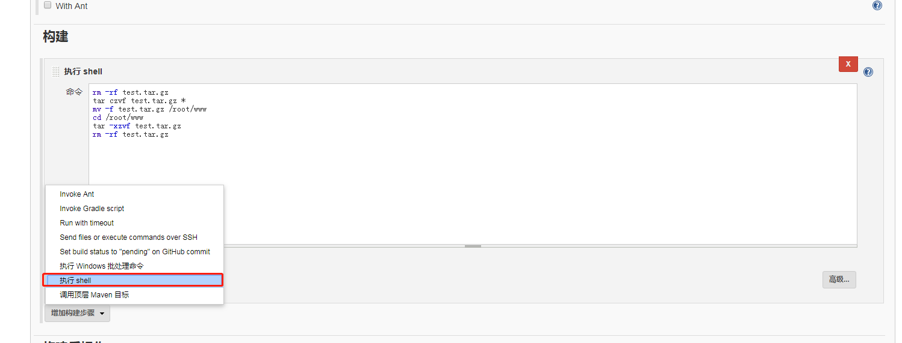
点击保存
返回到工程项目下 点击立即构建 等待成功
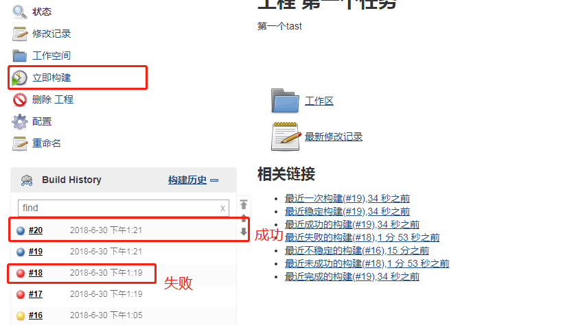
然后在本地浏览器输入你的 ip 地址加/html/home.html 就能看到构建的项目啦
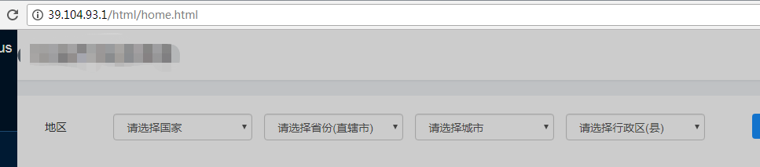
尝试在 git 上修改文件保存后 执行立即构建 成功后， 然后在本地浏览器刷新 发现代码已经修改
